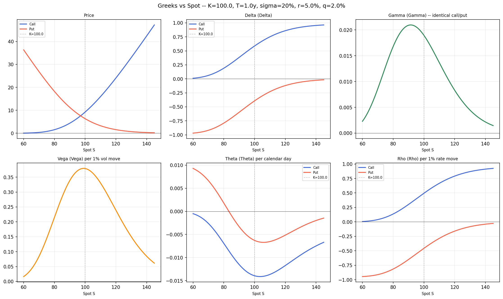
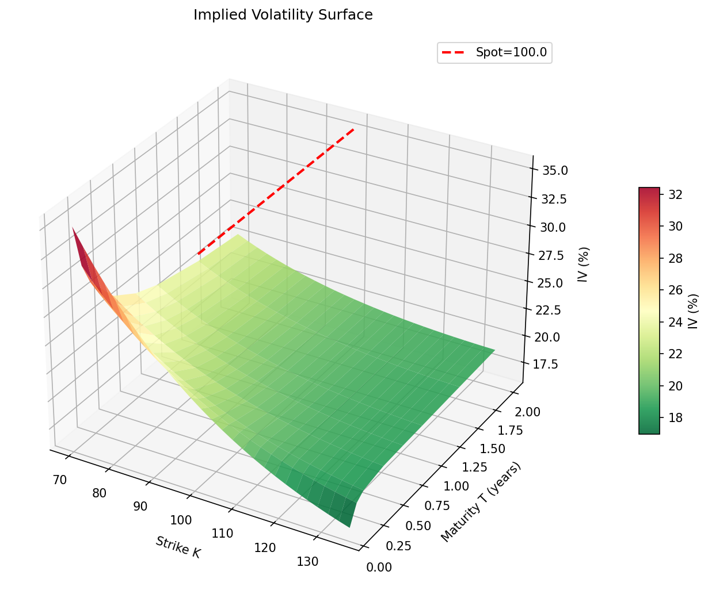
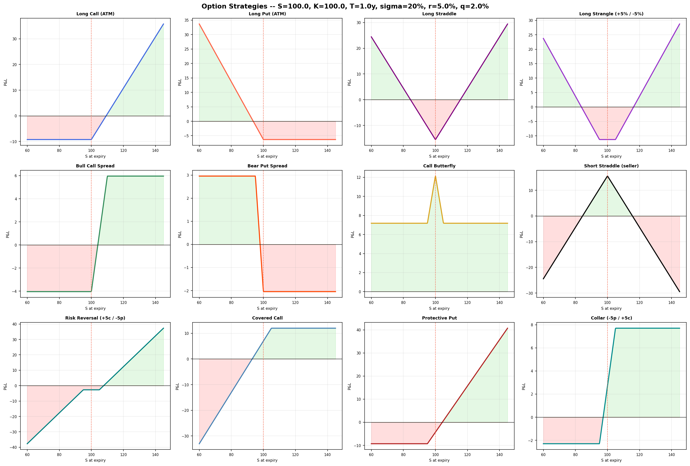

# Black-Scholes Options Pricer

A full-featured Black-Scholes options pricing engine built from scratch in Python, with an interactive web interface.

## Features

- **European pricing** — Call & Put with continuous dividend yield
- **Analytical Greeks** — Δ, Γ, ν, Θ, ρ, Vanna, Volga, Charm, Speed
- **Implied Volatility** — Brent inversion with arbitrage-bound checks
- **Vol Surface** — Parametric smile (quadratic, SVI, Heston approx.), 3D surface, skew by maturity, ATM term structure + bootstrapped forward vols
- **Strategy Payoffs** — 18 strategies (straddle, spreads, butterfly, iron condor, collar, covered call…) with pre-expiry P&L slices
- **Interactive UI** — Streamlit + Plotly dashboard with live sliders

## Stack

`Python` · `NumPy` · `SciPy` · `Matplotlib` · `Streamlit` · `Plotly`

## Quick Start

```bash
pip install -r requirements.txt
streamlit run app.py
```

Opens at `http://localhost:8501`.

To run the static analysis and export all figures:

```bash
python main.py
```

## Project Structure

```
├── bs_core.py          # Black-Scholes engine + all Greeks
├── implied_vol.py      # IV extraction via Brent, surface, delta-space
├── vol_surface.py      # Parametric models + visualisation utilities
├── payoff_analysis.py  # Strategy payoffs + structuring analytics
├── app.py              # Streamlit interactive UI
├── main.py             # CLI demo — prints results, saves 12 figures
└── requirements.txt
```

## Screenshots

| Greeks Profiles | Vol Surface | Strategy Payoffs |
|---|---|---|
|  |  |  |

## Usage Example

```python
from bs_core import BSOption
from implied_vol import implied_vol

# Price an ATM call
opt = BSOption(S=100, K=100, T=1.0, r=0.05, sigma=0.20, q=0.02, option='call')
print(opt.price)   # 9.2270
print(opt.delta)   # 0.5868
print(opt)         # full Greeks summary

# Extract implied vol from a market price
iv = implied_vol(market_price=9.50, S=100, K=100, T=1.0, r=0.05, q=0.02)
print(f"{iv*100:.4f}%")
```
